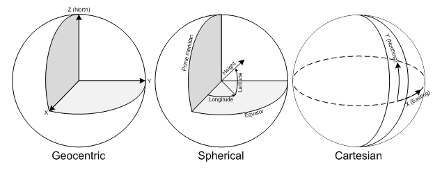

# Geographic Coordinate System (GCS)

A GCS is formed by 3 pieces of information: Datum, Coordinate System, and Projection.

## Datum

Datum defines the reference frame (origin) used to measure locations on Earth.  The shape of the Earth is a factor
when determining the reference frame.  Earth is commonly depicted as either a Sphere or Ellipsoid (Spheroid).  Using 
a Sphere makes calculations easier but is not the best appoximation because of flattening at the poles.

> The assumption that the earth is a sphere is possible for small-scale maps (smaller than 1:5,000,000). 
> At this scale, the difference between a sphere and a spheroid is not detectable on a map. 
> However, to maintain accuracy for larger-scale maps (scales of 1:1,000,000 or larger), 
> a spheroid is necessary to represent the shape of the earth. Between those scales, choosing to use a 
> sphere or spheroid will depend on the map's purpose and the accuracy of the data.
>
> In the last 15 years, satellite data has provided geodesists with new measurements to define the 
> best earth-fitting spheroid, which relates coordinates to the earth's center of mass. An earth-centered, 
> or geocentric, datum uses the earth's center of mass as the origin. The most recently developed and 
> widely used datum is WGS 1984. It serves as the framework for locational measurement worldwide. 
> [ESRI](http://webhelp.esri.com/arcgisdesktop/9.2/index.cfm?TopicName=Spheroids_and_spheres)

[WGS84 aka EPSG:4326](http://spatialreference.org/ref/epsg/4326/) is the most common datum in use.

It defines the Earth as an Ellipsoid with the following information:

    GEOGCS["WGS 84",
    DATUM["WGS_1984",
        SPHEROID["WGS 84",6378137,298.257223563,
            AUTHORITY["EPSG","7030"]],
        AUTHORITY["EPSG","6326"]],
    PRIMEM["Greenwich",0,
        AUTHORITY["EPSG","8901"]],
    UNIT["degree",0.01745329251994328,
        AUTHORITY["EPSG","9122"]],
    AUTHORITY["EPSG","4326"]]

Where:

* 6378137 is the Earth's radius in meters
* 298.257223563 is the flattening factor to the shape of the Ellipsoid

WGS84 is used by most GPS systems today.

GPS calculate positions using the [ECEF]() system.  Position is then converted to WGS coordinates for readability.  Actually WGS84 is based on ECEF with the exception the coordinate system is lat/lng.  However the orgin is still at 0,0,0.

## Coordinate System

With a reference frame for the shape of the earth, a coordinate system is also needed to define locations.  There
are 3 common coordinate systems

* Geocentric (X,Y,Z): An X,Y,Z coordinate system with it's origin at the center of the Earth [ECEF](). This is the coordinate system
used by GPS systems today (and is the underpinnings of WGS84?) .  But is often converted to Geographic coordinates for users (easier to understand). 

* Geographic (latitude/longitude): Geographic (Spherical) coordinates are angular measurements used to identify locations on earth.  The latitude is the anglular measurement North and South from the Equator in the range [-90, 90]. Longitude is the anglular measurement East and West starting from the Greenwich meridian in the range [-180, 180]

* Rectangular Coordinates (X, Y):  A cartesian coordinate system using X and Y values to represent vertical and horizontal positions usually in meters.  Rectangular coordinates are best fitted for 2d maps

[Source](http://www.sharpgis.net/post/2007/05/05/Spatial-references2c-coordinate-systems2c-projections2c-datums2c-ellipsoids-e28093-confusing.aspx)

## Projection

Projection essentially allows us to map a curved surface (Spheroid) on to a flat plane. Imagine drawing a map on a piece of paper and then trying to 'tape' the map onto say a basketball.  Projection allows us to transform the points from one to another.  No projection
is perfect all introduce some form of distoration of the map.  There are many projections, but 2 types are the most commonly used:

#### Cylindrical Equidistant Projection 
    
Aka: Cylindrical Equirectangular, Plate Carrée, Simple Cylindrical, WGS84 Geodetic, or WGS84 Lat/Lon projection. This approach does not scale the meridians of the original globe. Thus, distances are not distorted north-to-south. However, each line of latitude is stretched to the same length as the equator, providing significant stretching east-to-west. It also doesn't preserve area, shape, or bearing on the map.  The benefit of this map projection is the ease of construction, especially for com- puter mapping systems. One degree of latitude and one degree of longitude are the same length in any area of the map, therefore it preserves distance.

#### Conformal Projection (Mercator)

The Mercator projection is the most common used: Google Maps, Openstreet, etc.... A conformal projection preserves the shape and angles of a map.  Lines of longitude have equal lengths and are equally spaced. But lines of latitude increase as you move away from the equator resulting in stretching near the poles.   The mercator projection approaches infinity at the poles setting the maximum latitude to +- 85.05

Many popular web based mapping services use the Mercator projection based on a Sphere versus an Ellipsoid:

> To simplify the calculations, we use the spherical form of this projection, not the ellipsoidal form. Since 
> the projection is used only for map display, and not for displaying numeric coordinates, we don’t need 
> the extra precision of an ellipsoidal projection. The spherical projection causes approximately 0.33% 
> scale distortion in the Y direction, which is not visually noticeable.

[Bing Maps](http://msdn.microsoft.com/en-us/library/bb259689.aspx)  

## Spatial Reference System (SRS)

An SRS pulls all the information above together.  The EPSG repository lists hundereds of SRS configurations. The most common are:

* [EPSG:4326](http://spatialreference.org/ref/epsg/4326/) This is the WGS84 datum defining the shape of the Spheriod, the coordinate system, and the projection (which is the Cylindical Equidistant)

* [EPSG:3857](http://spatialreference.org/ref/sr-org/7483/) Aka EPSG: 900913. This is the Google Web Mercator - the most used for web maps.  It uses the WGS84 datum but instead the Equidistant projection it employs the mercator projection:

    PROJCS["WGS 84 / Pseudo-Mercator",
    GEOGCS["WGS 84",
        DATUM["WGS_1984",
            SPHEROID["WGS 84",6378137,298.257223563,
                AUTHORITY["EPSG","7030"]],
      

