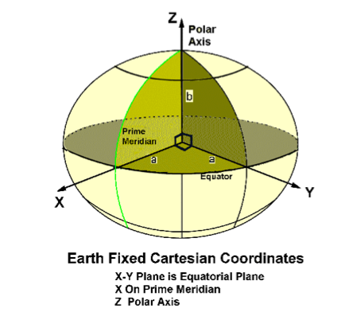

# Earth Centered Earth Fixed

> ECEF (Earth-Centered, Earth-Fixed), also known as ECR (Earth Centered Rotational), is a Cartesian 
> coordinate system, and is sometimes known as a "conventional terrestrial" system. It represents 
> positions as an X, Y, and Z coordinate. The point (0,0,0) is defined as the center of mass of the Earth, 
> hence the name Earth-Centered.

[Source](http://en.wikipedia.org/wiki/ECEF)

ECEF coordinates are the ones used by most satellites systems to designate an earth position. This is done because it gives precise values without having to choose a specific ellipsoid. Only the center of the earth and the orientation of the axis is needed.  To convert to angular coordinates, more information is needed. Some high precision applications remain in ECEF to avoid additional error. High precision geodetic bench marks have both angular and ECEF coordinates recorded in the data bases.

See [Conversion Formulas](../docs/ecef_conversions.pdf)

